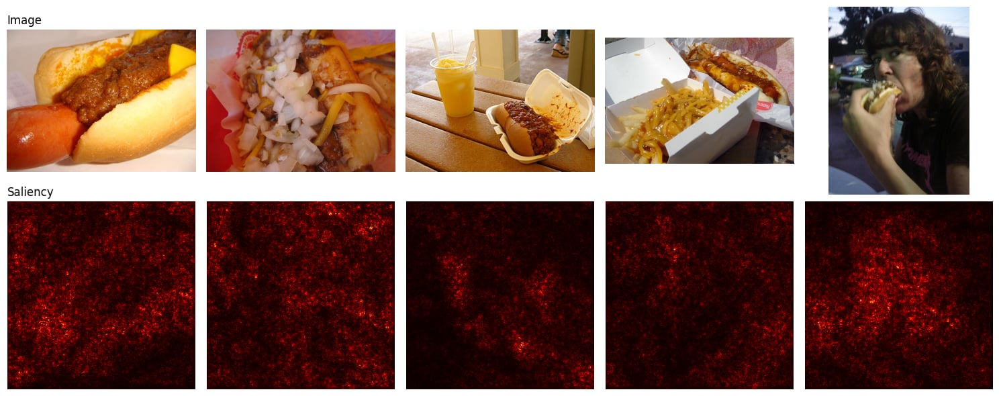

# Hotdog / Not Hotdog Classification

## 1. Introduction

The objective of this project was to classify images into two classes: `hotdog` and `not hotdog`. The dataset contains hotdog images and non-hotdog images from several ImageNet categories, including food, frankfurter, chili-dog, pets, furniture, and people.

The project compares convolutional neural networks trained from scratch with a pretrained convolutional neural network used through transfer learning.

## 2. Data and preprocessing

All input images have different resolutions and aspect ratios. To create batches with a common shape, the images were resized to 128 x 128 pixels for the CNN experiments.

The training pipeline used:

- Resize to 128 x 128
- Random horizontal flipping
- Random rotation of up to 10 degrees
- Random brightness, contrast, and saturation changes
- Conversion to tensors
- Normalization with mean `(0.5, 0.5, 0.5)` and standard deviation `(0.5, 0.5, 0.5)`

The test pipeline used resizing, tensor conversion, and the same normalization, but no random augmentation. This ensures that evaluation is deterministic.

For ResNet18, the images were resized to 224 x 224 pixels and normalized using the ImageNet mean and standard deviation, as expected by the pretrained model.

## 3. CNN trained from scratch

The first model was a small CNN with three convolutional layers. The number of channels increased from 3 to 16, 32, and 64. Each convolutional layer was followed by a ReLU activation and max pooling. The classifier consisted of a fully connected layer with dropout followed by a two-class output layer.

The model was trained using cross-entropy loss and the Adam optimizer with a learning rate of 0.001.

The final recorded result was:

| Model | Training accuracy | Test accuracy |
|---|---:|---:|
| Basic CNN | 83.29% | 78.79% |

The difference between training and test accuracy indicates some overfitting. However, the model still learned useful visual features and performed clearly above random guessing.

## 4. Regularization and batch normalization

A second CNN was designed to reduce overfitting. It used:

- Batch normalization after each convolution
- Adaptive average pooling
- Dropout with probability 0.5
- Adam with weight decay of `1e-4`
- Data augmentation
- Early stopping

Batch normalization stabilizes the distribution of activations during training. It can make optimization easier and often allows the network to train more reliably. Dropout and weight decay reduce the tendency of the model to memorize individual training examples.

The regularized model achieved a best recorded test accuracy of 78.89% before early stopping, essentially on par with the basic CNN (78.79%). In this experiment, batch normalization and stronger regularization did not produce a meaningful improvement in the final test accuracy compared with the basic CNN. This is an important result: regularization can reduce overfitting without necessarily increasing accuracy, especially when the model is already relatively small or the dataset contains difficult examples.

## 5. Deeper CNN

A deeper CNN was also tested by adding a fourth convolutional block with 128 channels. The model included batch normalization, dropout, adaptive average pooling, and weight decay.

The deeper model achieved:

| Model | Training accuracy | Test accuracy |
|---|---:|---:|
| Deeper CNN | 80.88% | 77.18% |

The additional convolutional block did not produce a major improvement; the deeper model in fact performed slightly worse than the basic CNN. Increasing depth gives the model more capacity to learn hierarchical features, but it also increases the risk of overfitting and does not guarantee better generalization.

## 6. Transfer learning with ResNet18

ResNet18 was used as a transfer learning model. ResNet18 is itself a convolutional neural network. It contains convolutional residual blocks and was pretrained on ImageNet.

All pretrained parameters were frozen, and the final fully connected layer was replaced with a classifier for two classes. The new classifier consisted of dropout followed by a linear layer with two outputs. Only this final classifier was trained using Adam.

The recorded result was:

| Model | Training accuracy | Test accuracy |
|---|---:|---:|
| ResNet18 transfer learning | 90.84% | 91.68% |

ResNet18 performed substantially better than the CNNs trained from scratch. The pretrained convolutional layers already contain useful low-level and mid-level visual features, such as edges, textures, shapes, and object parts. This is especially valuable when the available dataset is not large enough to train a deep network from scratch effectively.

## 7. Cross-validation

To evaluate the stability of the transfer learning result, stratified five-fold cross-validation was performed on the training set. Stratification preserved the class distribution in each fold. The separate test set was not used to create the folds.

The validation accuracies were:

| Fold | Validation accuracy |
|---:|---:|
| 1 | 94.63% |
| 2 | 93.90% |
| 3 | 92.42% |
| 4 | 95.84% |
| 5 | 93.15% |

The mean validation accuracy was **93.99%**, with a standard deviation of **1.18 percentage points**.

The relatively small standard deviation indicates that the ResNet18 result is reasonably stable across different training and validation splits.

## 8. Comparison of models

| Model | Main characteristics | Test accuracy |
|---|---|---:|
| Basic CNN | Three convolutional layers, Adam | 78.79% |
| Regularized CNN | Batch normalization, dropout, augmentation, weight decay | 78.89% |
| Deeper CNN | Four convolutional blocks, batch normalization, dropout | 77.18% |
| ResNet18 | ImageNet pretraining, frozen convolutional backbone | 91.68% |

The strongest model was ResNet18 with transfer learning. The results suggest that pretrained features were more important than simply increasing the depth of a small CNN trained from scratch.

## 9. Saliency maps and SmoothGrad

To understand which pixels the ResNet18 transfer-learning model relies on for its `hotdog` predictions, vanilla gradient saliency maps and SmoothGrad saliency maps were computed for five hotdog images from the test set.

A vanilla saliency map is the gradient of the model's `hotdog` class score with respect to the input pixels, `M(x) = |∂s_hotdog(x) / ∂x|`, taking the maximum absolute gradient across the three color channels. SmoothGrad averages this map over `n = 25` noisy copies of the image, each perturbed by Gaussian noise `ε ~ N(0, σ²I)` with `σ = 0.15`. Adding this noise to an image `x` is mathematically equivalent to sampling directly from `N(x, σ²I)`, since `x + ε` with `ε ~ N(0, σ²I)` has exactly that distribution. Averaging the saliency map over many such samples cancels out much of the pixel-level noise that a single gradient evaluation produces.

The five test images, their vanilla saliency maps, and their SmoothGrad maps (σ = 0.15) are shown below.

Do the saliency maps make sense? Only partially. The vanilla saliency maps are dominated by high-frequency, speckled noise spread across the entire image, with no clear concentration on the hotdog itself. SmoothGrad is somewhat cleaner, and for two of the five images (the hotdog-and-fries combo and the person eating a hotdog) there is a faintly brighter region roughly overlapping the hotdog/mouth area, suggesting the model does pick up on relevant content there. For the other three images, however, the improvement over vanilla saliency is marginal, and none of the maps produce a crisp outline of the hotdog shape.

A likely explanation is that the saliency gradient passes through the entire ResNet18 backbone, which was pretrained on ImageNet and kept frozen; only the final classifier layer was fine-tuned. The backbone is a deep, piecewise-linear network (many ReLU non-linearities), which is exactly the kind of network known to produce noisy raw gradients. SmoothGrad's noise-averaging only partially compensates for this with a modest sample count (`n = 25`) and a single, fairly arbitrarily chosen noise level (`σ = 0.15`). A larger sample count or a small sweep over `σ` would likely produce clearer maps, but this was not explored further here due to time constraints.

## 10. Discussion

The experiments show that increasing model complexity alone is not sufficient to obtain better performance. The deeper CNN had more feature extraction layers, but its test accuracy remained similar to (in fact slightly below) the basic CNN. This indicates that the main limitation was not simply the number of layers.

Batch normalization and regularization helped control the training process, but the regularized model only matched the baseline's test accuracy in this run rather than clearly outperforming it. The random augmentation may also have made the training task harder, while the dataset size and visual variation limited the achievable performance of the small CNNs.

Transfer learning was substantially more effective. ResNet18 could use representations learned from a much larger dataset, which allowed it to generalize better to the hotdog classification task.

## 11. Limitations and remaining analysis

The current notebook does not yet contain a systematic list of misclassified test images, only a qualitative check on a handful of custom images. A full confusion-matrix-style breakdown of which test images are misclassified, and why, would strengthen the error analysis.

The saliency and SmoothGrad maps (Section 9) are noisier than typical examples in the literature; a hyperparameter sweep over the noise level `σ` and the number of samples `n` was not performed and is left as future work.

Model selection throughout development used a held-out validation split from the training data (Section 2); the separate test set was evaluated only once per model, at the end of training.

## 12. Use of generative AI

ChatGPT was used as a programming assistant during the project. It helped with debugging file paths and tensor shapes, suggesting model variations, explaining convolutional neural networks and transfer learning, and organizing parts of the report.

The project decisions, interpretation of the results, and understanding of the underlying machine learning methods were based on the student's existing background in artificial intelligence and independent evaluation of the experiments. ChatGPT was used as support, not as a replacement for the student's technical work or judgment.

## 13. Conclusion

The best-performing approach was transfer learning with ResNet18. It achieved 91.68% test accuracy, while five-fold cross-validation produced a mean validation accuracy of 93.99% with a standard deviation of 1.18 percentage points.

The results demonstrate that pretrained convolutional features can provide a substantial advantage over a small CNN trained from scratch. Saliency and SmoothGrad maps show only a weak, partial signal that the model attends to the hotdog region itself, suggesting the frozen ImageNet backbone's raw gradients remain noisy even after averaging; a more thorough error analysis and a hyperparameter sweep for SmoothGrad are natural next steps.
